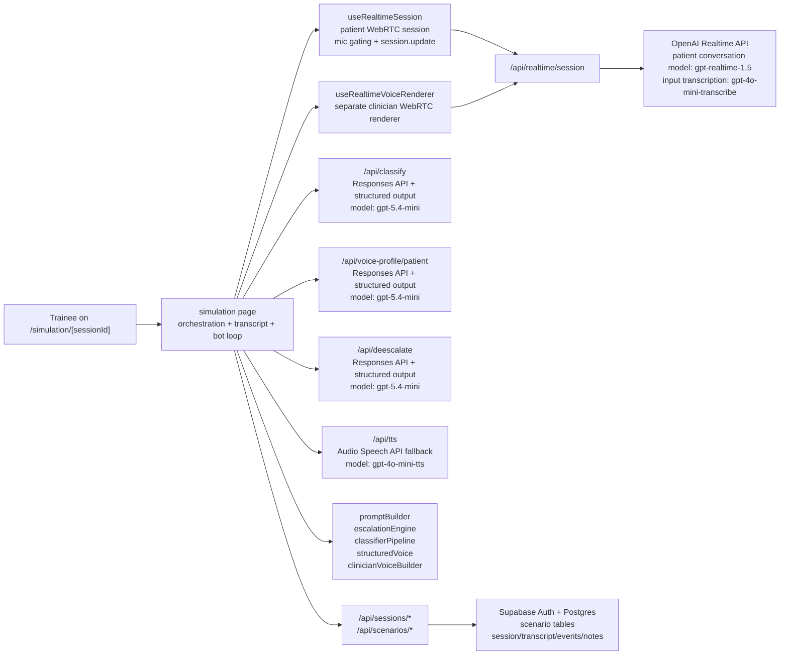

# SimGritty Architecture Overview

This document reflects the architecture currently implemented in the codebase, not an older prompt or model mix.

## System Diagram

## 1. Core Runtime

The live simulation is orchestrated from `src/app/simulation/[sessionId]/page.tsx`, with two distinct realtime paths:

- **Patient conversation path** via `src/hooks/useRealtimeSession.ts`: handles the primary WebRTC session, trainee microphone input, patient audio playback, input transcription events, mic gating, and `session.update` prompt refreshes.
- **Clinician voice path** via `src/hooks/useRealtimeVoiceRenderer.ts`: a second, separate WebRTC connection used only when the bot clinician speaks.

The server route `src/app/api/realtime/session/route.ts` creates ephemeral Realtime sessions. The default realtime model is `gpt-realtime-1.5`, and patient-session input transcription is configured with `gpt-4o-mini-transcribe`.

For clinician speech, the realtime renderer now distinguishes three execution outcomes:

- **completed**: realtime playback reached a clean stop and bot handoff proceeds normally
- **partial**: realtime playback started, but the control path did not close cleanly; the system does not replay the line via TTS, and instead applies a conservative tail guard before allowing the patient to respond
- **failed**: realtime speech never got going cleanly, so the system falls back to the HTTP TTS route

## 2. Prompting And Patient Behaviour

The patient is driven by a four-layer prompt built in `src/lib/engine/promptBuilder.ts`:

1. **System layer**: immutable roleplay and safety rules.
2. **State layer**: current escalation state, traits, bias state, and escalation ceiling.
3. **Memory layer**: recent conversation turns.
4. **Voice layer**: either a deterministic voice description or a structured voice profile rendered into prompt text.

Scenarios are authored through the App Router scenario pages and stored across:

- `scenario_templates`
- `scenario_traits`
- `scenario_voice_config`
- `escalation_rules`

When a session is created, the scenario is frozen into `simulation_sessions.scenario_snapshot`, so session playback and forking are based on the original session state rather than the latest template edits.

## 3. Structured Generation And Classification

There are three GPT-5.4-mini structured-output routes, all using the Responses API with `responses.parse(...)` and Zod schemas:

- `src/app/api/classify/route.ts` via `src/lib/engine/classifierPipeline.ts`
- `src/app/api/voice-profile/patient/route.ts` via `src/lib/openai/structuredVoice.ts`
- `src/app/api/deescalate/route.ts` via `src/lib/openai/structuredVoice.ts`

The classifier pipeline now has **three modes**, not two:

- `trainee_utterance`
- `patient_response`
- `clinician_utterance`

It can also take the latest structured delivery profile as context, so classification is based on both the words spoken and how the utterance was delivered.

Patient voice-profile generation returns a seven-field structured profile:

- accent
- voice affect
- tone
- pacing
- emotion
- delivery
- variety

Clinician turn generation returns:

- the next clinician line
- a technique label
- a structured clinician voice profile

## 4. Escalation Engine

`src/lib/engine/escalationEngine.ts` holds the live state:

- escalation level (1–10)
- trust (0–10)
- willingness to listen (0–10)
- anger (0–10)
- frustration (0–10)
- boundary respect (0–10)
- discrimination active (boolean flag)
- behaviour counters: interruptions, validations, unanswered questions

Important current behaviour from the code:

- **Trainee** and **clinician** utterances can move escalation state.
- **Patient-response** classifications do **not** change the escalation level directly; they currently act as state-tracking and behavioural bookkeeping.
- Clinician-generated recovery is intentionally damped (0.5× multiplier) relative to trainee turns, so the bot does not calm the patient unrealistically fast.
- **Asymmetric reactivity**: already-escalated patients are more reactive to rudeness (anger multiplier 1.0–1.5×, impatience boost 1.0–1.3×).
- **Narrow deadzone**: near-neutral effectiveness values (−0.1 to −0.15 depending on state) are treated as no change, preventing drift from borderline classifications.
- **Trust penalty**: low trust slows recovery, so a patient who has lost trust does not de-escalate as easily.
- **Anger resistance**: high anger (≥ 4) adds friction to de-escalation.
- **Per-turn caps**: escalation can rise by at most +3 and fall by at most −2 in a single turn.

## 5. Bot Clinician Flow

Bot mode is not just “generate text and play audio”. The current flow is:

1. Disable patient turn detection and force the trainee mic off.
2. Interrupt any in-flight patient response and clear patient playback.
3. Prefetch the next clinician turn through `src/app/api/deescalate/route.ts`.
4. Render clinician audio through the dedicated realtime renderer when available.
5. Fall back to `src/app/api/tts/route.ts` if realtime clinician speech is unavailable.
6. Classify the clinician turn with `clinician_utterance` mode.
7. Let the patient respond on the main realtime session.
8. Run a **critical patient-state update**: classify the patient reply, update escalation state, rebuild the patient prompt immediately using the cached voice profile, persist that turn snapshot, and prefetch the next clinician turn.
9. Run a **background refinement**: regenerate the patient voice profile, patch the saved transcript turn with the refined prompt/profile, and refresh the prefetched clinician turn if the refined voice state arrived in time.

The clinician audio system is dual-path:

- **Primary**: separate Realtime renderer (`useRealtimeVoiceRenderer`)
- **Fallback**: HTTP speech route using `gpt-4o-mini-tts`

The clinician voice instructions are built in `src/lib/engine/clinicianVoiceBuilder.ts`. If a structured clinician voice profile is available, it is used directly; otherwise the builder falls back to deterministic technique- and state-aware instructions.

Two extra protections were added to keep bot-mode speech reliable:

- **Length-aware realtime timeout**: clinician realtime playback timeout scales with utterance length (base 5 s + 500 ms per word, clamped between 15 s and 30 s) to avoid timing out normal longer clinician turns.
- **No replay after partial realtime playback**: if realtime audio already started and then degraded, the system avoids replaying the same clinician line through TTS from the beginning, because that caused obvious duplicate speech and voice switching.

### Clinician Audio Telemetry

Every bot clinician turn emits a `clinician_audio` state event recording:

- `path`: `"realtime"`, `"tts"`, or `"none"` (aborted before any audio)
- `realtime_outcome`: `"completed"`, `"partial"`, or `"failed"` (null if realtime was never attempted)
- `fallback_reason` and `renderer_error`: diagnostic strings when the primary path did not succeed
- `elapsed_ms`: wall-clock time from audio request to completion

These events are persisted via `POST /api/sessions/:id/events`. Because the `clinician_audio` event type requires a DB migration, the events route includes a graceful fallback: if the insert fails with a constraint error (migration not yet applied), the event is re-inserted as `classification_result` with an `__event_kind: "clinician_audio"` marker in the payload. The EventLog and review page detect both storage forms transparently.

### Persistence Infrastructure

All persistence calls from the simulation page (`persistTranscriptTurn`, `updatePersistedTurnSnapshot`, `persistSessionEvent`, session end) are tracked through a central `pendingPersistenceRef` set. Requests use `keepalive: true` for reliability during page transitions. Before navigating to the review page on session end, `flushPendingPersistence()` awaits all in-flight persistence calls (with a 2.5 s timeout), ensuring the review page loads with complete data.

## 6. Scoring

`src/lib/engine/scoring.ts` computes a post-session performance breakdown with four dimensions:

- **De-escalation effectiveness** (0–40 points): based on peak vs final escalation level relative to the initial level.
- **Speed of resolution** (0–25 points): rewards quick de-escalation.
- **Independence** (0–25 points): penalises heavy reliance on the AI clinician by comparing trainee vs bot turn counts.
- **Stability** (0–10 points): penalises wild escalation swings during the session.

These sum to an overall score (0–100) mapped to a letter grade (A+ through F) with an auto-generated summary sentence.

## 7. Scenario Authoring: Traits And Archetypes

`src/lib/engine/traitDials.ts` defines 15 scenario trait dials across three categories:

- **Emotional**: intensity, hostility, frustration, impatience, trust
- **Behavioural**: listening, sarcasm, volatility, boundary respect, interruption, coherence, repetition
- **Cognitive**: entitlement, bias intensity, escalation tendency

Each trait has a 0–10 range with human-readable low/high labels and is paired with a bias category selector (none, gender, racial, age, accent, class/status, role/status, mixed).

`src/lib/engine/archetypePresets.ts` provides five ready-made scenario configurations:

1. **De-escalation Fundamentals** (moderate) — frustrated relative
2. **Professional Boundary Setting** (moderate) — entitled patient
3. **Responding to Discriminatory Language** (high) — hostile with active bias
4. **Breaking Difficult News** (high) — grief-focused
5. **High-Pressure Confrontation** (extreme) — volatile and accusatory

Each preset bundles scenario defaults, a full trait profile, voice configuration, and escalation rules.

## 8. Persistence, Review, And Forking

Supabase stores:

- authored scenarios (`scenario_templates`, `scenario_traits`, `scenario_voice_config`, `escalation_rules`)
- live and completed sessions (`simulation_sessions` with frozen `scenario_snapshot`)
- transcript turns (`transcript_turns` with per-turn snapshots: `classifier_result`, `trigger_type`, `state_after`, `patient_voice_profile_after`, `patient_prompt_after`)
- simulation state events (`simulation_state_events` — event types: `session_started`, `session_ended`, `escalation_change`, `de_escalation_change`, `ceiling_reached`, `trainee_exit`, `classification_result`, `clinician_audio`, `prompt_update`, `error`)
- educator notes

The session APIs persist transcript turns and state events during the live run, then the review pages reconstruct transcript, escalation history, scoring, and educator annotations from that stored data.

### Review Page

The review page (`src/app/review/[sessionId]/page.tsx`) loads session, transcript, events, and educator notes in parallel. It includes a retry mechanism (up to 8 attempts at 750 ms intervals) that re-fetches if the session data appears incomplete — specifically if `exit_type`, `peak_escalation_level`, or `ended_at` are missing, or if clinician turns are present but no `clinician_audio` events have arrived yet. This handles the race between the simulation page's final persistence flush and the review page load.

Summary cards include a **Clinician Audio** card showing the Realtime success rate and breakdown (completed / partial / TTS fallback). The `TranscriptViewer` displays per-turn audio delivery badges, and the `EventLog` renders clinician audio events with path, timing, and error details.

Forking is session-based rather than template-based: a new session can be created from an earlier session and turn index, reusing the frozen scenario snapshot and the saved turn/state history. Fork metadata tracks `parent_session_id`, `forked_from_session_id`, `forked_from_turn_index`, `fork_label`, and `branch_depth`.
