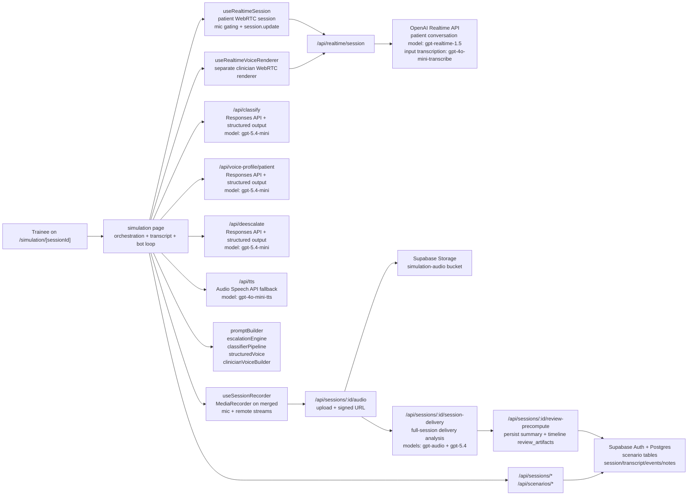

# PROLOG Architecture Overview

Last verified against the codebase on 2026-04-12.

This document reflects the architecture currently implemented in the repository. It is an implementation reference, not a roadmap. The separate `docs/elevenlabs-plan.md` file is proposal-only.

## System Diagram

## 1. Core Runtime

The live simulation is orchestrated from `src/app/simulation/[sessionId]/page.tsx`, with two distinct realtime paths:

- **Patient conversation path** via `src/hooks/useRealtimeSession.ts`: handles the primary WebRTC session, trainee microphone input, patient audio playback, input transcription events, mic gating, and `session.update` prompt refreshes.
- **Clinician voice path** via `src/hooks/useRealtimeVoiceRenderer.ts`: a second, separate WebRTC connection used only when the bot clinician speaks.
- **Session audio recording** via `src/hooks/useSessionRecorder.ts`: merges the trainee's local mic stream and the AI's remote audio stream into a single mixed recording using `AudioContext` + `MediaStreamDestination` and records continuously with `MediaRecorder`. The recording runs passively alongside the simulation with zero per-turn overhead. On session end, the blob is uploaded to Supabase Storage and the path is persisted on the session record.

The server route `src/app/api/realtime/session/route.ts` creates ephemeral Realtime sessions. The default realtime model is `gpt-realtime-1.5`, and patient-session input transcription is configured with `gpt-4o-mini-transcribe`.

For clinician speech, the realtime renderer now distinguishes three execution outcomes:

- **completed**: realtime playback reached a clean stop and bot handoff proceeds normally
- **partial**: realtime playback started, but the control path did not close cleanly; the system does not replay the line via TTS, and instead applies a conservative tail guard before allowing the patient to respond
- **failed**: realtime speech never got going cleanly, so the system falls back to the HTTP TTS route

## 2. Prompting And Patient Behaviour

The patient is driven by a four-layer prompt built in `src/lib/engine/promptBuilder.ts`:

1. **System layer**: immutable roleplay and safety rules.
2. **State layer**: current escalation state, traits, whether configured prejudice is currently active, explicit language guidance for the current patient state, and escalation ceiling.
3. **Memory layer**: recent conversation turns.
4. **Voice layer**: either a deterministic voice description or a structured voice profile rendered into prompt text.

The prompt now explicitly tells the model that the actual wording must match the current patient state. At higher states, that means swearing, insulting, or threatening language is expected in the words themselves rather than only in tone. When bias is configured, the prompt restricts discriminatory behaviour to the authored bias categories instead of letting it drift into unrelated prejudice.

Scenarios are authored through the App Router scenario pages and stored across:

- `scenario_templates` (includes `scoring_weights`, `support_threshold`, `critical_threshold`, `clinical_task_enabled`)
- `scenario_traits`
- `scenario_voice_config`
- `escalation_rules`
- `scenario_milestones` (optional, 0-10 per scenario — each has a description and classifier hint)

When a session is created, the scenario is frozen into `simulation_sessions.scenario_snapshot`, so session playback and forking are based on the original session state rather than the latest template edits.

## 3. Structured Generation And Classification

There are three GPT-5.4-mini structured-output routes, all using the Responses API with `responses.parse(...)` and Zod schemas:

- `src/app/api/classify/route.ts` via `src/lib/engine/classifierPipeline.ts`
- `src/app/api/voice-profile/patient/route.ts` via `src/lib/openai/structuredVoice.ts`
- `src/app/api/deescalate/route.ts` via `src/lib/openai/structuredVoice.ts`

The classifier pipeline has **three modes**:

- `trainee_utterance` — uses an extended Zod schema (`TRAINEE_SCORING_SCHEMA`) that adds scoring fields: `composure_markers` (array of negative indicators), `de_escalation_attempt` (boolean), `de_escalation_technique` (technique label), and `clinical_milestone_completed` (milestone ID or null). When milestones are defined for the scenario, only **uncompleted** milestones are passed in the classifier context — the simulation page tracks completed milestone IDs in a ref and filters them out before each classifier call, so the model focuses on detecting new completions rather than re-flagging the same one. On session resume or fork, completed milestone state is recovered from persisted transcript turns.
- `patient_response`
- `clinician_utterance`

Patient and clinician modes use the base schema (`CLASSIFIER_OUTPUT_SCHEMA`). The trainee mode uses a higher token limit (400 vs 220) to accommodate the additional fields.

Classification also takes the latest inferred structured delivery profile as context, so it is based on both the words spoken and how the utterance was likely delivered.

On the human-trainee path, patient voice-profile generation now consumes the latest inferred trainee voice profile as well. That means the patient can react to how the trainee seemed to sound, not just to the transcript text. The important limitation is that this live trainee profile is still text/context-derived rather than direct live audio, so prosody-only cues such as subtle sarcasm can still be missed in the live loop.

Patient voice-profile generation returns a seven-field structured profile:

- accent
- voice affect
- tone
- pacing
- emotion
- delivery
- variety

The patient voice-profile request also consumes the authored `bias_intensity`, `bias_category`, and live `discrimination_active` flag alongside the numeric escalation/trust/anger state. That keeps generated delivery guidance aligned with scenarios that are meant to become discriminatory, hostile, or overtly abusive at higher patient states.

Clinician turn generation returns:

- the next clinician line
- a technique label
- a structured clinician voice profile

## 4. Session-Level Delivery Analysis

The primary trainee delivery path is now session-level rather than per-utterance. It runs after the mixed session recording has been uploaded and is intended for review, not for changing the next live patient reply.

Current flow:

1. `useSessionRecorder` records one mixed file containing the trainee mic plus the remote patient audio.
2. `POST /api/sessions/:id/audio` uploads that file to Supabase Storage.
3. `POST /api/sessions/:id/session-delivery` loads the session transcript, scenario snapshot, and existing events.
4. If a cached session-level delivery event is already present, the route reuses it. If there are fewer than two trainee turns, it returns `null`.
5. Otherwise `src/lib/openai/sessionDeliveryAnalysis.ts` sends the mixed recording plus transcript anchors to `gpt-audio`.
6. If the audio model does not return clean structured data, a second structuring pass uses `gpt-5.4`.
7. Supported output is persisted as a `classification_result` event with `__event_kind: "session_audio_delivery"`.
8. `POST /api/sessions/:id/review-precompute` then builds the summary and timeline artifacts, which can include this session-level delivery aggregate.
9. `GET /api/sessions/:id/transcript` logs both legacy turn-level delivery coverage and the session-level delivery status so it is obvious which path supplied the evidence.

The session-level payload uses the same marker family as the older turn-level route:

- `calm_measured`
- `warm_empathic`
- `tense_hurried`
- `flat_detached`
- `defensive_tone`
- `sarcastic_tone`
- `irritated_tone`
- `hostile_tone`
- `anxious_unsteady`

Important current rules from the code:

- `supported=true` requires a recurrent pattern across at least two trainee turns, not a one-off moment.
- The confidence threshold is currently `0.55`.
- `trend` is constrained to `improving`, `worsening`, `steady`, `mixed`, or `null`.
- If the evidence is weak, isolated, or mixed, the route still returns a parsed object when it can, but it suppresses learner-facing summary text.

The legacy `/api/analysis/trainee-delivery` clip-analysis route still exists in the repo and its fallback events can still be merged into transcript rows. It is no longer the primary top-half review path.

## 5. Escalation Engine

`src/lib/engine/escalationEngine.ts` holds the live state:

- escalation level (1–10)
- trust (0–10)
- willingness to listen (0–10)
- anger (0–10)
- frustration (0–10)
- boundary respect (0–10)
- discrimination active (boolean flag, derived dynamically from authored bias intensity/category plus the current patient state)
- behaviour counters: interruptions, validations, unanswered questions

Important current behaviour from the code:

- **Trainee** and **clinician** utterances can move escalation state.
- **Patient-response** classifications do **not** change the escalation level directly; they currently act as state-tracking and behavioural bookkeeping.
- Clinician-generated recovery is intentionally damped (0.5× multiplier) relative to trainee turns, so the bot does not calm the patient unrealistically fast.
- **Asymmetric reactivity**: already-escalated patients are more reactive to rudeness (anger multiplier 1.0–1.5×, impatience boost 1.0–1.3×).
- **Narrow deadzone**: near-neutral effectiveness values (−0.1 to −0.15 depending on state) are treated as no change, preventing drift from borderline classifications.
- **Trust penalty**: low trust slows recovery, so a patient who has lost trust does not de-escalate as easily.
- **Anger resistance**: high anger (≥ 4) adds friction to de-escalation.
- **Per-turn caps**: escalation can rise by at most +3 and fall by at most −2 in a single turn.
- **Dynamic discrimination flag**: `discrimination_active` is recalculated as the conversation evolves. High-intensity bias can surface early; milder configured bias stays latent until the patient state is more escalated.

## 6. Bot Clinician Flow

Bot mode is not just “generate text and play audio”. The current flow is:

1. Disable patient turn detection and force the trainee mic off.
2. Interrupt any in-flight patient response and clear patient playback.
3. Prefetch the next clinician turn through `src/app/api/deescalate/route.ts`.
4. Render clinician audio through the dedicated realtime renderer when available.
5. Fall back to `src/app/api/tts/route.ts` if realtime clinician speech is unavailable.
6. Classify the clinician turn with `clinician_utterance` mode.
7. Let the patient respond on the main realtime session.
8. Run a **critical patient-state update**: classify the patient reply, update escalation state, rebuild the patient prompt immediately using the cached voice profile, persist that turn snapshot, and prefetch the next clinician turn.
9. Run a **background refinement**: regenerate the patient voice profile, patch the saved transcript turn with the refined prompt/profile, and refresh the prefetched clinician turn if the refined voice state arrived in time.

The clinician audio system is dual-path:

- **Primary**: separate Realtime renderer (`useRealtimeVoiceRenderer`)
- **Fallback**: HTTP speech route using `gpt-4o-mini-tts`

The clinician voice instructions are built in `src/lib/engine/clinicianVoiceBuilder.ts`. If a structured clinician voice profile is available, it is used directly; otherwise the builder falls back to deterministic technique- and state-aware instructions.

Two extra protections were added to keep bot-mode speech reliable:

- **Length-aware realtime timeout**: clinician realtime playback timeout scales with utterance length (base 5 s + 500 ms per word, clamped between 15 s and 30 s) to avoid timing out normal longer clinician turns.
- **No replay after partial realtime playback**: if realtime audio already started and then degraded, the system avoids replaying the same clinician line through TTS from the beginning, because that caused obvious duplicate speech and voice switching.

### Clinician Audio Telemetry

Every bot clinician turn emits a `clinician_audio` state event recording:

- `path`: `"realtime"`, `"tts"`, or `"none"` (aborted before any audio)
- `realtime_outcome`: `"completed"`, `"partial"`, or `"failed"` (null if realtime was never attempted)
- `fallback_reason` and `renderer_error`: diagnostic strings when the primary path did not succeed
- `elapsed_ms`: wall-clock time from audio request to completion

These events are persisted via `POST /api/sessions/:id/events`. Because the `clinician_audio` event type requires a DB migration, the events route includes a graceful fallback: if the insert fails with a constraint error (migration not yet applied), the event is re-inserted as `classification_result` with an `__event_kind: "clinician_audio"` marker in the payload. The EventLog and review page detect both storage forms transparently.

### Persistence Infrastructure

All persistence calls from the simulation page (`persistTranscriptTurn`, `updatePersistedTurnSnapshot`, `persistSessionEvent`, session end) are tracked through a central `pendingPersistenceRef` set. Requests use `keepalive: true` for reliability during page transitions. Before navigating to the review page on session end, `flushPendingPersistence()` awaits all in-flight persistence calls (with a 2.5 s timeout), ensuring the review page loads with complete data.

### Abandoned Session Handling

Sessions that are not explicitly ended by the trainee (tab close, hard refresh, or SPA navigation to another page) are automatically closed via two mechanisms:

- **Tab close / hard refresh**: a `beforeunload` event listener fires `navigator.sendBeacon` to `POST /api/sessions/:id/end` with `exit_type: "instant_exit"`. `sendBeacon` is guaranteed to be dispatched by the browser even as the page tears down, with no risk of blocking navigation.
- **SPA navigation** (component unmount): the simulation page's main `useEffect` cleanup fires a `fetch` with `keepalive: true` to the same endpoint if `endingRef.current` is false (i.e. `handleEndSession` was not already called).

Both paths are no-ops if `endingRef.current` is already true, preventing double-end when the trainee uses the normal End Session button or when max-duration auto-end fires.

## 7. Scoring

`src/lib/engine/scoring.ts` computes a post-session performance breakdown across four dimensions, each scored 0–100:

- **Composure**: starts at 100 and subtracts weighted penalties when composure markers are detected. Dismissive or hostile responses cost more than lighter markers, repeated markers compound across the session, and poor composure is penalised more heavily when the patient/relative is already highly escalated.
- **De-escalation**: measures the rate and effectiveness of de-escalation attempts. Score = attempt_rate × 0.4 + success_rate × 0.6, then turns that further inflame an already-escalated interaction subtract from that result. Effectiveness is measured by whether escalation level dropped on the next patient/relative reply, provided the AI clinician did not intervene first. Only turns where the patient/relative is actively escalated count.
- **Clinical Task Maintenance** (optional): ratio of completed milestones to total milestones defined for the scenario. Excluded entirely if no milestones are defined. Milestones are tracked silently during the session (not shown to the trainee) and appear on the review page as natural clinical evidence rather than checklist items.
- **Support Seeking**: starts from 100. Appropriate clinician takeover episodes receive a small credit, premature requests are penalised, and each trainee turn taken at or above the support threshold without asking for help counts as a missed opportunity. If the unsupported situation then worsens into the critical range or reaches level 10, additional penalties apply. Legacy scenarios without an explicit support threshold fall back to the critical threshold or level 6 so the dimension still reflects real missed intervention opportunities.

The overall score is a weighted average using scenario-defined weights (or equal defaults). When clinical task is excluded, weights are renormalized across the remaining three dimensions.

When `trainee_delivery_analysis` is present, composure and de-escalation also receive small, confidence-gated adjustments from the audio-derived markers. For example, `warm_empathic` can help slightly, while `defensive_tone`, `flat_detached`, or `tense_hurried` can subtract from the score. Low-confidence audio readings are deliberately damped.

Free-text `learning_objectives` do **not** directly change the numeric score. They are used later in review generation as narrative objective guidance, especially when no authored milestones exist or when a broader scenario aim needs to be surfaced explicitly.

**Qualitative labels**: Strong (80–100), Developing (60–79), Needs practice (0–59).

**Session validity gate**: sessions under 3 trainee turns show no score. Sessions of 3–6 trainee turns display scores with a "preliminary" caveat, and their dimension scores are moderated toward the midpoint so sparse evidence does not produce hard zero or hundred scores too easily.

**Evidence tracking**: every scoring event (marker detected, attempt made, milestone completed, support invoked) is recorded with its turn index and score impact. That scoring evidence still powers the bottom-of-page score block and feeds the persisted review evidence ledger, but the top-half review surfaces no longer render directly from score-ranked canned moments. GPT-5.4 now selects and writes the learner-facing review moments from the ledger plus transcript context.

The current review flow computes score and evidence on demand from transcript turns, events, and scenario snapshot data. `session_scores` and `session_score_evidence` may exist in the schema as legacy or future-use tables, but the current app flow does not write them.

## 8. Scenario Authoring: Traits And Archetypes

`src/lib/engine/traitDials.ts` defines **14 numeric trait dials** across three categories, plus a separate bias-category selector:

- **Emotional**: hostility, frustration, impatience, trust
- **Behavioural**: willingness_to_listen, sarcasm, volatility, boundary_respect, interruption_likelihood
- **Cognitive / contextual**: coherence, repetition, entitlement, bias_intensity, escalation_tendency

Each numeric trait has a 0–10 range with human-readable low/high labels. Bias category is configured separately (`none`, `gender`, `racial`, `age`, `accent`, `class_status`, `role_status`, `mixed`).

`src/lib/engine/archetypePresets.ts` provides five ready-made scenario configurations:

1. **De-escalation Fundamentals** (moderate) — frustrated relative
2. **Professional Boundary Setting** (moderate) — entitled patient
3. **Responding to Discriminatory Language** (high) — hostile with active bias
4. **Breaking Difficult News** (high) — grief-focused
5. **High-Pressure Confrontation** (extreme) — volatile and accusatory

Each preset bundles scenario defaults, a full trait profile, voice configuration, and escalation rules.

## 9. Persistence, Review, And Forking

Supabase stores:

- authored scenarios (`scenario_templates`, `scenario_traits`, `scenario_voice_config`, `escalation_rules`, `scenario_milestones`)
- live and completed sessions (`simulation_sessions` with frozen `scenario_snapshot`, `recording_path`, `recording_started_at`, legacy `review_summary`, and persisted `review_artifacts`)
- session audio recordings (Supabase Storage bucket `simulation-audio`, private, one `.webm` file per session)
- transcript turns (`transcript_turns` with per-turn snapshots: `classifier_result`, `trainee_delivery_analysis`, `trigger_type`, `state_after`, `patient_voice_profile_after`, `patient_prompt_after`)
- simulation state events (`simulation_state_events` — event types: `session_started`, `session_ended`, `escalation_change`, `de_escalation_change`, `ceiling_reached`, `trainee_exit`, `classification_result`, `clinician_audio`, `prompt_update`, `error`; both trainee clip-delivery fallback events and session-level delivery events are stored as `classification_result` with `__event_kind: "trainee_audio_delivery"` or `__event_kind: "session_audio_delivery"`)
- optional legacy scoring tables (`session_scores`, `session_score_evidence`) that are not used by the current review flow
- trainee reflections (`session_reflections`)
- educator notes

The session APIs persist transcript turns and state events during the live run, then the review pages reconstruct transcript, escalation history, scoring, and educator annotations from that stored data.

### Review Page

The review page (`src/app/review/[sessionId]/page.tsx`) loads session, transcript, events, and educator notes in parallel. It still includes a retry mechanism to handle the race between the simulation page's final persistence flush and the review page load, but it now also treats failed or stale stored review metadata as incomplete so the client can refetch rather than treating an old failure as final.

The schema supports `exit_type` values `normal`, `instant_exit`, `educator_ended`, `timeout`, `auto_ceiling`, and `max_duration`. The current UI/runtime paths actively emit `normal`, `instant_exit`, `auto_ceiling`, and `max_duration`.

`POST /api/sessions/[id]/review-precompute` is the main end-of-session review pipeline. It loads transcript, events, scenario snapshot, score, and session-level delivery evidence; builds a persisted review evidence ledger; runs GPT-5.4 review-moment selection; and then generates summary and timeline artifacts in parallel. After that succeeds, it also refreshes the persisted learner+scenario `Review your progress` artifact for the scenario. The simulation page warns that this portal review generation can take 1-2 minutes because this route is allowed to spend real wall-clock time after `End scenario`.

`POST /api/sessions/[id]/review-summary` is now a wrapper around the persisted `review_artifacts.summary`. It verifies ownership, ensures summary artifacts exist, and returns `{ summary, debug }`. If summary generation fails, the route returns `summary: null` plus explicit debug metadata such as `failureClass` and validator codes. Learner-facing deterministic fallback prose is no longer used here.

`GET /api/sessions/[id]/timeline-feedback` is a wrapper around `review_artifacts.timeline`. It ensures timeline artifacts exist, then returns `{ timeline, debug }`. The timeline is now produced in two LLM stages: GPT-5.4 selects the review moments from the evidence ledger, then GPT-5.4 renders one card per selected moment. If either stage fails, the route returns debug metadata instead of silently swapping in canned timeline prose.

`GET /api/sessions/[id]/scenario-history` now serves a persisted learner+scenario artifact for the `Review your progress` panel. It still rebuilds a scenario-history evidence hash from the current user's non-deleted sessions in the same scenario, but successful output is stored in `scenario_history_artifacts` and reused across that learner's review pages for the scenario. The canonical panel is generated against the learner's latest session in the scenario, so older review pages can show a panel that includes later runs. If the evidence hash changes, the route regenerates and upserts the artifact; it still returns `{ summary, debug }` and does not fall back to learner-facing deterministic coaching prose.

### Responsive Layout

Both the simulation page and the review page are designed to work on mobile phones as well as desktops:

- **AppShell**: the sidebar nav (`w-56`) is hidden below the `md` breakpoint. The TopBar renders compact icon-based navigation links and a sign-out button on mobile instead.
- **Simulation page**: uses a tab bar (Simulation / Transcript / Scenario) below `lg`, switching to the three-panel layout on larger screens.
- **Review page**: the reflection check-in always appears first, followed by the Session Summary slot, then the Conversation Timeline, `Review your progress`, the `Ready to try again?` retry CTA, the transcript/event-log/notes section switcher, and finally the score breakdown or the short-session placeholder at the very bottom. The escalation timeline chart height reduces from `h-72` to `h-56` on mobile. Transcript/Event Log/Notes use `60vh` height on mobile instead of a fixed 500px. The Transcript / Event Log / Educator Notes section switcher is rendered as an explicit three-button segmented control, and mobile places the "Restart From Turn" action in its own full-width action area below the transcript list.

The review page displays:

- **Top review section**: the `ReflectionPrompt` appears first and is always full width. The `ReviewSummaryCard` is always mounted in the top slot; if generation fails it shows an explicit unavailable/debug state rather than disappearing or swapping in canned prose.
- **Reflection prompt**: unscored trainee self-reflection with emotion tags and free text, persisted separately from performance data and kept at the top of the review page even for short sessions. The prompt text now asks, "How do you think that conversation went?" If saved reflection data cannot be loaded, the component stays visible and shows an inline error state rather than disappearing.
- **Session summary**: one overview block plus `What Helped`, `Why It Mattered`, and `Next Best Move`, with an optional `Overall Delivery` note when the session-level delivery aggregate is strong enough to mention at conversation level. The summary is generated from the persisted review evidence ledger, transcript context, and objective coverage. Successful output is cached in `review_artifacts`; failed output surfaces debug metadata rather than learner-facing fallback coaching.
- **Conversation timeline**: always visible on the main screen (no longer in a tab), showing the conversation-intensity path with event markers, optional session-audio playback, a hover/playback cursor, and a persistent detail panel for the selected key moment.
- **Timeline coaching cards**: up to 4 model-selected teachable moments rendered as numbered tabs beneath the chart. The active card shows the headline, likely impact, one-turn-before/one-turn-after transcript context, what happened next, why it mattered here, and a next-best move when relevant. Selection and rendering are both LLM-driven from the evidence ledger; failed generation surfaces debug metadata rather than local narrative fallback.
- **Review your progress**: a coach-style scenario-history panel built from the current user's non-deleted sessions in the same scenario. Its count is session-based, not utterance-based. It presents one primary target, up to two secondary patterns, and one practice target. The artifact is stored per learner+scenario and reused across review pages, with a discreet note that older pages can include later runs.
- **Ready to try again?**: a scenario-level retry CTA that creates a fresh session from the same scenario so the learner can immediately practise the coached move again.
- **ScoreCard**: qualitative label badge (Strong / Developing / Needs practice), an overall score badge, and four dimension bars (0–100) with weight percentages. Sessions under 3 trainee turns show the short-session placeholder instead of the score card, and that placeholder now appears at the very bottom of the review page where the full score would normally sit.
- **Section switcher**: Transcript, Event Log, and Educator Notes are shown one panel at a time using a segmented control rather than the previous tabs primitive.
- **Audio delivery note**: trainee turns can show a separate `Audio delivery note` row with 0-3 markers and a short summary. The current transcript view does not display a standalone confidence badge.
- **Fallback merge**: if `trainee_delivery_analysis` is missing on the transcript row but present in fallback events, the transcript API backfills it before returning rows, and the review page also merges the fallback payload defensively before rendering and scoring.

### Live Simulation Copy

The simulation page intentionally exposes trainee-facing copy rather than engine terminology:

- the live meter is labelled **Patient/relative status** rather than "Escalation"
- the support action is **Ask AI clinician for help**
- the return action is **Resume conversation**
- while bot mode is active, status text explains that the AI clinician is speaking on the trainee's behalf or that the patient/relative is responding to the AI clinician
- the live classifier summary is hidden from the trainee; technique labels and effectiveness remain part of scoring/review, not the in-session UI

The `TranscriptViewer` displays per-turn audio delivery markers plus a short audio-delivery summary when present, and the `EventLog` renders clinician audio events with path, timing, and error details. When a session has a recording, each trainee and patient turn shows a play button that seeks to the correct offset in the full session recording and plays the audio for that utterance.

### Session Audio Recording And Playback

Each simulation session is continuously recorded as a single mixed audio file (trainee mic + AI remote audio). The recording is uploaded to Supabase Storage (`simulation-audio` bucket) at session end via `POST /api/sessions/:id/audio`, which also persists `recording_path` and `recording_started_at` on the session record. The route verifies that the authenticated user owns the session, then performs the Storage write via the admin Supabase client so bucket RLS does not block uploads for valid sessions.

On the review page, `GET /api/sessions/:id/audio` returns a time-limited signed URL. The `TranscriptViewer` calculates per-turn seek offsets relative to `recording_started_at` (the exact timestamp when `MediaRecorder.start()` was called, not `session.started_at` which is set earlier during session init). Offset calculation accounts for the fact that transcript `started_at` timestamps represent speech *end* rather than speech *start*:

- **Trainee turns**: seek to the previous AI turn's `started_at` (AI speech end ≈ trainee speech start).
- **Patient/AI turns**: seek to the previous trainee turn's `started_at` minus a 3-second buffer, because the AI begins responding before the trainee's transcript event arrives.

Forking is session-based rather than template-based: a new session can be created from an earlier session and turn index, reusing the frozen scenario snapshot and the saved turn/state history. Fork metadata tracks `parent_session_id`, `forked_from_session_id`, `forked_from_turn_index`, `fork_label`, and `branch_depth`.

## 10. Access Control

### Authentication

PROLOG uses **email OTP (magic link)** via Supabase Auth. Access is restricted to `@nhs.scot` email addresses — the login page validates the domain client-side before calling Supabase, so non-NHS.scot addresses never reach the auth service. The OTP flow:

1. `POST supabase.auth.signInWithOtp({ email, options: { emailRedirectTo: '/auth/confirm' } })`
2. Supabase emails a magic link via Resend; the user clicks it
3. The browser loads `/auth/confirm` — a **client-side page** that renders a green "Complete sign-in" button
4. The user clicks the button; the browser Supabase client calls `verifyOtp({ token_hash, type })` (or `exchangeCodeForSession(code)` for the PKCE code flow) and redirects to `/dashboard`

The confirm page is intentionally client-side rather than a server-side route handler. Email clients (including Outlook's reading pane) make background GET requests to links in emails; a server-side handler would consume the one-time token before the user ever clicked. With a client-side page the token is only consumed when JavaScript runs in a real browser and the user explicitly clicks the button.

There is no self-service password-based signup. Supabase creates a new user record automatically on first OTP sign-in for any valid `@nhs.scot` address.

### Authorisation

Three user roles exist: **admin**, **educator**, and **trainee**, stored on `user_profiles.role`.

Current enforcement:

- **Scenario creation** (`POST /api/scenarios`): restricted to admin and educator roles.
- **Org settings modification** (`PUT /api/org-settings`): restricted to admin role.
- **Session deletion** (`DELETE /api/sessions/:id/delete`): restricted to the session's `trainee_id` (owner only).
- **Scenario deletion** (`DELETE /api/scenarios/:id`): restricted to the scenario's `created_by` (owner only).
- **Session start** (`POST /api/sessions/:id/start`): restricted to the session's `trainee_id`.

The dashboard hides delete buttons for items the current user does not own. The scenario edit page and settings page display a notice that full RBAC will be implemented in the next version.

Read access to sessions, transcripts, events, educator notes, audio, and scenarios is currently open to all authenticated users. This is intentional for the current phase to allow management visibility across the platform. Row-level security policies are planned for a future release.

### Organisation Settings

`org_settings` currently stores four governance fields:

- `max_escalation_ceiling`
- `max_session_duration_minutes`
- `allow_discriminatory_content`
- `require_consent_gate`

Runtime enforcement is mixed:

- `max_escalation_ceiling` is enforced in scenario editing and live simulation.
- `max_session_duration_minutes` is enforced in live simulation via auto-end.
- `allow_discriminatory_content` is persisted and editable, but is not yet wired to block discriminatory scenario authoring or runtime behaviour.
- `require_consent_gate` is persisted and editable, but the briefing flow currently always shows the consent gate.

### User Identity

`user_profiles` stores `display_name` and `email` (added via migration, backfilled from `auth.users`, and kept in sync by the `handle_new_user` trigger). The dashboard displays the user's name as a greeting, session lists show the trainee's full identity as "Display Name (email)", and the scenario edit page shows the creator's name. A lightweight profile API (`GET /api/profile`) returns the current user's profile for client-side identity checks.

## 11. Dashboard

The dashboard (`src/app/dashboard/page.tsx`) currently has a welcome header plus two main content sections:

- **Scenarios available to you**: a tinted panel (`bg-muted/40`) containing compact fixed-width cards (220px) for published scenarios, each linking directly to the briefing page. Cards show difficulty, title, and setting.
- **Recent sessions**: the most recent sessions across all users, loaded from `/api/sessions/recent?limit=20` with offset pagination and a `Load older sessions` CTA. Rows show scenario title, trainee identity, session date/time (preferring `started_at`, then `ended_at`, then `created_at`), peak escalation level, exit status, and an owner-only delete button.

## 12. Landing Page

The landing page (`src/app/page.tsx`) is a marketing-style overview rather than a redirect. It uses real session screenshots (`/public/screenshots/`) for the escalation timeline and transcript demos, an `IsometricDiagramV3` component for the system architecture section, and inline "prolog" text rendered in the Host Grotesk Bold logo font in dark teal (`#0d2d3a`) via a `
` helper component, with a lighter variant (`#7ec8c8`) for use on dark backgrounds. The page includes feature, outputs, configuration, workflow, audience, architecture, privacy, roadmap, and CTA sections; the configuration demo still uses interactive mock sliders.

### Footer and Privacy Statement

The footer contains the PROLOG wordmark, a "Built for NHS Scotland and HSCP staff" tag, and a `PrivacyStatement` client component (`src/components/landing/PrivacyStatement.tsx`). The component renders as a collapsed trigger — a `ShieldCheck` icon, "Privacy Statement" label, and a `ChevronDown` that rotates on open — and expands in-place to show the full 13-section UK GDPR privacy statement covering data collection, third-party providers (Supabase, OpenAI, Vercel), international transfers, retention, and individual rights. The test-service warning ("PROLOG is currently a test application…") is rendered at the top of the expanded content inside a distinct orange bordered box (`border-2 border-orange-400 bg-orange-50`) to visually separate it from the numbered privacy sections.

### Test-Purposes Banner

A sticky orange banner (`bg-orange-500`, `text-zinc-900`, `z-50`) is rendered at the top of every page via the root layout (`src/app/layout.tsx`), above all other content. It reads: "⚠ This site is for test purposes only — do not enter real patient data or sensitive clinical information." Because the banner occupies 36 px of vertical space, all full-height containers that previously used `h-screen` have been updated to `h-[calc(100vh-36px)]`: the `AppShell` wrapper, the `Sidebar`, and the loading/main views in the simulation page.

### Branding

The logo uses Host Grotesk Bold (700) in lowercase "prolog" with dark teal colouring (`#0d2d3a`). The speech bubble icon uses the same dark teal with a white medical cross. The wordmark is rendered without a subtitle across the app (header, sidebar, footer). Nunito Sans is the base UI font. Dashboard status badges use semantic colours (teal for published, emerald for completed, red for aborted) distinct from the primary blue used for CTA buttons.

### Sign-In Flow

The sign-in flow is intentionally two-step:

1. The login page (`/auth/login`) accepts only `@nhs.scot` email addresses and sends a magic link.
2. The emailed link opens `/auth/confirm`, which renders a final green **Complete sign-in** button.
3. The user clicks that button to verify the OTP client-side and proceed into the app.

This avoids background email-client link prefetches consuming the one-time token before the user reaches a real browser.
