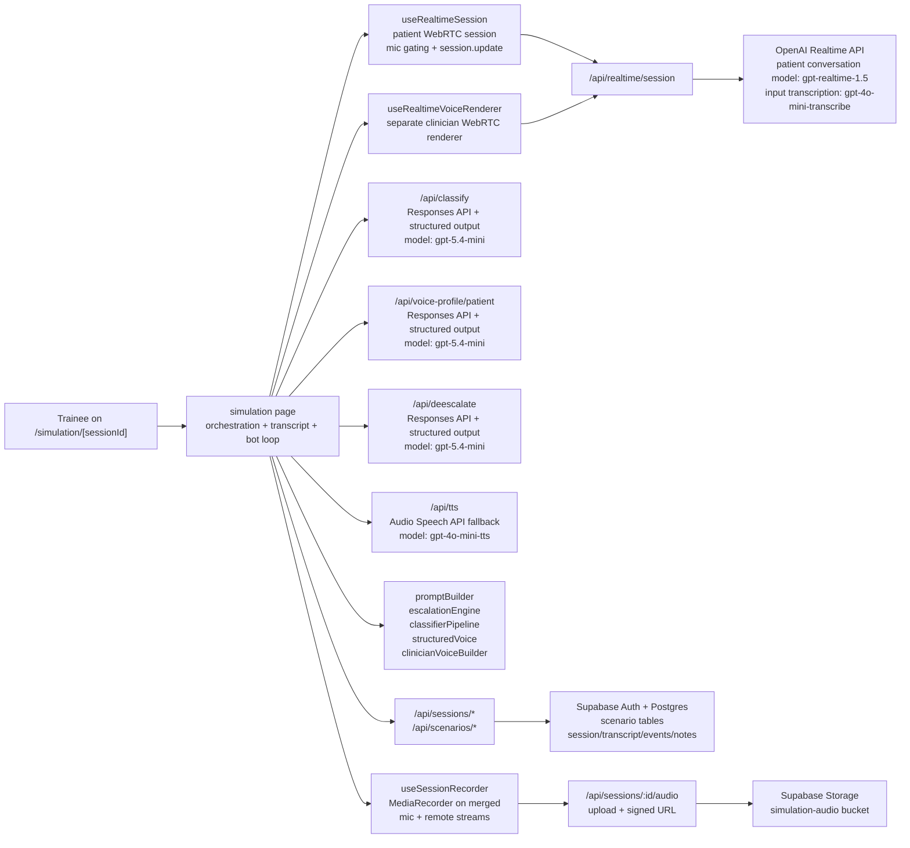

# PROLOG Architecture Overview

This document reflects the architecture currently implemented in the codebase, not an older prompt or model mix.

## System Diagram

## 1. Core Runtime

The live simulation is orchestrated from `src/app/simulation/[sessionId]/page.tsx`, with two distinct realtime paths:

- **Patient conversation path** via `src/hooks/useRealtimeSession.ts`: handles the primary WebRTC session, trainee microphone input, patient audio playback, input transcription events, mic gating, and `session.update` prompt refreshes.
- **Clinician voice path** via `src/hooks/useRealtimeVoiceRenderer.ts`: a second, separate WebRTC connection used only when the bot clinician speaks.
- **Session audio recording** via `src/hooks/useSessionRecorder.ts`: merges the trainee's local mic stream and the AI's remote audio stream into a single mixed recording using `AudioContext` + `MediaStreamDestination` and records continuously with `MediaRecorder`. The recording runs passively alongside the simulation with zero per-turn overhead. On session end, the blob is uploaded to Supabase Storage and the path is persisted on the session record.

The server route `src/app/api/realtime/session/route.ts` creates ephemeral Realtime sessions. The default realtime model is `gpt-realtime-1.5`, and patient-session input transcription is configured with `gpt-4o-mini-transcribe`.

For clinician speech, the realtime renderer now distinguishes three execution outcomes:

- **completed**: realtime playback reached a clean stop and bot handoff proceeds normally
- **partial**: realtime playback started, but the control path did not close cleanly; the system does not replay the line via TTS, and instead applies a conservative tail guard before allowing the patient to respond
- **failed**: realtime speech never got going cleanly, so the system falls back to the HTTP TTS route

## 2. Prompting And Patient Behaviour

The patient is driven by a four-layer prompt built in `src/lib/engine/promptBuilder.ts`:

1. **System layer**: immutable roleplay and safety rules.
2. **State layer**: current escalation state, traits, bias state, and escalation ceiling.
3. **Memory layer**: recent conversation turns.
4. **Voice layer**: either a deterministic voice description or a structured voice profile rendered into prompt text.

Scenarios are authored through the App Router scenario pages and stored across:

- `scenario_templates` (includes `scoring_weights`, `support_threshold`, `critical_threshold`, `clinical_task_enabled`)
- `scenario_traits`
- `scenario_voice_config`
- `escalation_rules`
- `scenario_milestones` (optional, 0-10 per scenario — each has a description and classifier hint)

When a session is created, the scenario is frozen into `simulation_sessions.scenario_snapshot`, so session playback and forking are based on the original session state rather than the latest template edits.

## 3. Structured Generation And Classification

There are three GPT-5.4-mini structured-output routes, all using the Responses API with `responses.parse(...)` and Zod schemas:

- `src/app/api/classify/route.ts` via `src/lib/engine/classifierPipeline.ts`
- `src/app/api/voice-profile/patient/route.ts` via `src/lib/openai/structuredVoice.ts`
- `src/app/api/deescalate/route.ts` via `src/lib/openai/structuredVoice.ts`

The classifier pipeline has **three modes**:

- `trainee_utterance` — uses an extended Zod schema (`TRAINEE_SCORING_SCHEMA`) that adds scoring fields: `composure_markers` (array of negative indicators), `de_escalation_attempt` (boolean), `de_escalation_technique` (technique label), and `clinical_milestone_completed` (milestone ID or null). When milestones are defined for the scenario, only **uncompleted** milestones are passed in the classifier context — the simulation page tracks completed milestone IDs in a ref and filters them out before each classifier call, so the model focuses on detecting new completions rather than re-flagging the same one. On session resume or fork, completed milestone state is recovered from persisted transcript turns.
- `patient_response`
- `clinician_utterance`

Patient and clinician modes use the base schema (`CLASSIFIER_OUTPUT_SCHEMA`). The trainee mode uses a higher token limit (400 vs 220) to accommodate the additional fields.

Classification also takes the latest structured delivery profile as context, so it is based on both the words spoken and how the utterance was delivered.

Patient voice-profile generation returns a seven-field structured profile:

- accent
- voice affect
- tone
- pacing
- emotion
- delivery
- variety

Clinician turn generation returns:

- the next clinician line
- a technique label
- a structured clinician voice profile

## 4. Escalation Engine

`src/lib/engine/escalationEngine.ts` holds the live state:

- escalation level (1–10)
- trust (0–10)
- willingness to listen (0–10)
- anger (0–10)
- frustration (0–10)
- boundary respect (0–10)
- discrimination active (boolean flag)
- behaviour counters: interruptions, validations, unanswered questions

Important current behaviour from the code:

- **Trainee** and **clinician** utterances can move escalation state.
- **Patient-response** classifications do **not** change the escalation level directly; they currently act as state-tracking and behavioural bookkeeping.
- Clinician-generated recovery is intentionally damped (0.5× multiplier) relative to trainee turns, so the bot does not calm the patient unrealistically fast.
- **Asymmetric reactivity**: already-escalated patients are more reactive to rudeness (anger multiplier 1.0–1.5×, impatience boost 1.0–1.3×).
- **Narrow deadzone**: near-neutral effectiveness values (−0.1 to −0.15 depending on state) are treated as no change, preventing drift from borderline classifications.
- **Trust penalty**: low trust slows recovery, so a patient who has lost trust does not de-escalate as easily.
- **Anger resistance**: high anger (≥ 4) adds friction to de-escalation.
- **Per-turn caps**: escalation can rise by at most +3 and fall by at most −2 in a single turn.

## 5. Bot Clinician Flow

Bot mode is not just “generate text and play audio”. The current flow is:

1. Disable patient turn detection and force the trainee mic off.
2. Interrupt any in-flight patient response and clear patient playback.
3. Prefetch the next clinician turn through `src/app/api/deescalate/route.ts`.
4. Render clinician audio through the dedicated realtime renderer when available.
5. Fall back to `src/app/api/tts/route.ts` if realtime clinician speech is unavailable.
6. Classify the clinician turn with `clinician_utterance` mode.
7. Let the patient respond on the main realtime session.
8. Run a **critical patient-state update**: classify the patient reply, update escalation state, rebuild the patient prompt immediately using the cached voice profile, persist that turn snapshot, and prefetch the next clinician turn.
9. Run a **background refinement**: regenerate the patient voice profile, patch the saved transcript turn with the refined prompt/profile, and refresh the prefetched clinician turn if the refined voice state arrived in time.

The clinician audio system is dual-path:

- **Primary**: separate Realtime renderer (`useRealtimeVoiceRenderer`)
- **Fallback**: HTTP speech route using `gpt-4o-mini-tts`

The clinician voice instructions are built in `src/lib/engine/clinicianVoiceBuilder.ts`. If a structured clinician voice profile is available, it is used directly; otherwise the builder falls back to deterministic technique- and state-aware instructions.

Two extra protections were added to keep bot-mode speech reliable:

- **Length-aware realtime timeout**: clinician realtime playback timeout scales with utterance length (base 5 s + 500 ms per word, clamped between 15 s and 30 s) to avoid timing out normal longer clinician turns.
- **No replay after partial realtime playback**: if realtime audio already started and then degraded, the system avoids replaying the same clinician line through TTS from the beginning, because that caused obvious duplicate speech and voice switching.

### Clinician Audio Telemetry

Every bot clinician turn emits a `clinician_audio` state event recording:

- `path`: `"realtime"`, `"tts"`, or `"none"` (aborted before any audio)
- `realtime_outcome`: `"completed"`, `"partial"`, or `"failed"` (null if realtime was never attempted)
- `fallback_reason` and `renderer_error`: diagnostic strings when the primary path did not succeed
- `elapsed_ms`: wall-clock time from audio request to completion

These events are persisted via `POST /api/sessions/:id/events`. Because the `clinician_audio` event type requires a DB migration, the events route includes a graceful fallback: if the insert fails with a constraint error (migration not yet applied), the event is re-inserted as `classification_result` with an `__event_kind: "clinician_audio"` marker in the payload. The EventLog and review page detect both storage forms transparently.

### Persistence Infrastructure

All persistence calls from the simulation page (`persistTranscriptTurn`, `updatePersistedTurnSnapshot`, `persistSessionEvent`, session end) are tracked through a central `pendingPersistenceRef` set. Requests use `keepalive: true` for reliability during page transitions. Before navigating to the review page on session end, `flushPendingPersistence()` awaits all in-flight persistence calls (with a 2.5 s timeout), ensuring the review page loads with complete data.

## 6. Scoring

`src/lib/engine/scoring.ts` computes a post-session performance breakdown across four dimensions, each scored 0–100:

- **Composure**: starts at 100, subtracts penalties when composure markers are detected (defensive language, dismissive responses, hostility mirroring, sarcasm). Multiple markers on one turn incur a 1.5× penalty.
- **De-escalation**: measures the rate and effectiveness of de-escalation attempts. Score = attempt_rate × 0.4 + success_rate × 0.6. Effectiveness is measured by whether escalation level dropped on the next patient reply, provided the AI clinician did not intervene first. Only turns where the patient is actively escalated count.
- **Clinical Task Maintenance** (optional): ratio of completed milestones to total milestones defined for the scenario. Excluded entirely if no milestones are defined. Milestones are tracked silently during the session (not shown to the trainee) and appear on the review page as natural clinical evidence rather than checklist items.
- **Support Seeking**: starts at a baseline of 70. Each clinician takeover episode at or above the scenario's support threshold adds +15; below the threshold subtracts -15. Sustained critical escalation without help-seeking incurs additional penalties.

The overall score is a weighted average using scenario-defined weights (or equal defaults). When clinical task is excluded, weights are renormalized across the remaining three dimensions.

**Qualitative labels**: Strong (80–100), Developing (60–79), Needs practice (0–59).

**Session validity gate**: sessions under 6 trainee turns show no score. Sessions of 6–12 trainee turns display scores with a "preliminary" caveat.

**Evidence tracking**: every scoring event (marker detected, attempt made, milestone completed, support invoked) is recorded with its turn index and score impact. The review page shows the 2–3 highest-impact moments and a technique suggestion based on the weakest dimension.

Scoring data is persisted to `session_scores` (one row per session) and `session_score_evidence` (one row per scoring event).

## 7. Scenario Authoring: Traits And Archetypes

`src/lib/engine/traitDials.ts` defines 15 scenario trait dials across three categories:

- **Emotional**: intensity, hostility, frustration, impatience, trust
- **Behavioural**: listening, sarcasm, volatility, boundary respect, interruption, coherence, repetition
- **Cognitive**: entitlement, bias intensity, escalation tendency

Each trait has a 0–10 range with human-readable low/high labels and is paired with a bias category selector (none, gender, racial, age, accent, class/status, role/status, mixed).

`src/lib/engine/archetypePresets.ts` provides five ready-made scenario configurations:

1. **De-escalation Fundamentals** (moderate) — frustrated relative
2. **Professional Boundary Setting** (moderate) — entitled patient
3. **Responding to Discriminatory Language** (high) — hostile with active bias
4. **Breaking Difficult News** (high) — grief-focused
5. **High-Pressure Confrontation** (extreme) — volatile and accusatory

Each preset bundles scenario defaults, a full trait profile, voice configuration, and escalation rules.

## 8. Persistence, Review, And Forking

Supabase stores:

- authored scenarios (`scenario_templates`, `scenario_traits`, `scenario_voice_config`, `escalation_rules`, `scenario_milestones`)
- live and completed sessions (`simulation_sessions` with frozen `scenario_snapshot`, `recording_path`, `recording_started_at`)
- session audio recordings (Supabase Storage bucket `simulation-audio`, private, one `.webm` file per session)
- transcript turns (`transcript_turns` with per-turn snapshots: `classifier_result`, `trigger_type`, `state_after`, `patient_voice_profile_after`, `patient_prompt_after`)
- simulation state events (`simulation_state_events` — event types: `session_started`, `session_ended`, `escalation_change`, `de_escalation_change`, `ceiling_reached`, `trainee_exit`, `classification_result`, `clinician_audio`, `prompt_update`, `error`)
- session scores and evidence (`session_scores`, `session_score_evidence`)
- trainee reflections (`session_reflections`)
- educator notes

The session APIs persist transcript turns and state events during the live run, then the review pages reconstruct transcript, escalation history, scoring, and educator annotations from that stored data.

### Review Page

The review page (`src/app/review/[sessionId]/page.tsx`) loads session, transcript, events, and educator notes in parallel. It includes a retry mechanism (up to 8 attempts at 750 ms intervals) that re-fetches if the session data appears incomplete — specifically if `exit_type`, `peak_escalation_level`, or `ended_at` are missing, or if clinician turns are present but no `clinician_audio` events have arrived yet. This handles the race between the simulation page's final persistence flush and the review page load.

### Responsive Layout

Both the simulation page and the review page are designed to work on mobile phones as well as desktops:

- **AppShell**: the sidebar nav (`w-56`) is hidden below the `md` breakpoint. The TopBar renders compact icon-based navigation links and a sign-out button on mobile instead.
- **Simulation page**: uses a tab bar (Simulation / Transcript / Scenario) below `lg`, switching to the three-panel layout on larger screens.
- **Review page**: ScoreCard stacks vertically on mobile (label + ring inline, summary below). Summary cards use a 2-column grid on mobile, 3 on `sm`, 5 on `lg`. The escalation timeline chart height reduces from `h-80` to `h-56` on mobile. Transcript/Event Log/Notes use `60vh` height on mobile instead of a fixed 500px. The "Restart From Turn" button goes full-width below the card title on mobile.

The review page displays:

- **ScoreCard**: qualitative label badge (Strong / Developing / Needs practice), overall circular progress, and four dimension bars (0–100) with weight percentages. A session validity gate blocks scoring for sessions under 6 trainee turns.
- **Escalation timeline**: always visible on the main screen (no longer in a tab), showing escalation level and trust over time with event markers.
- **Key moments**: 2–3 highest-impact scoring events with transcript excerpts and context.
- **Technique suggestion**: one "Next time, try" recommendation based on the weakest scoring dimension.
- **Summary cards**: turns, events, peak level, exit type, and clinician audio success rate.
- **Tabs**: Transcript, Event Log, Educator Notes.
- **Reflection prompt**: unscored trainee self-reflection with emotion tags and free text, persisted separately from performance data.

The `TranscriptViewer` displays per-turn audio delivery badges, and the `EventLog` renders clinician audio events with path, timing, and error details. When a session has a recording, each trainee and patient turn shows a play button that seeks to the correct offset in the full session recording and plays the audio for that utterance.

### Session Audio Recording And Playback

Each simulation session is continuously recorded as a single mixed audio file (trainee mic + AI remote audio). The recording is uploaded to Supabase Storage (`simulation-audio` bucket) at session end via `POST /api/sessions/:id/audio`, which also persists `recording_path` and `recording_started_at` on the session record.

On the review page, `GET /api/sessions/:id/audio` returns a time-limited signed URL. The `TranscriptViewer` calculates per-turn seek offsets relative to `recording_started_at` (the exact timestamp when `MediaRecorder.start()` was called, not `session.started_at` which is set earlier during session init). Offset calculation accounts for the fact that transcript `started_at` timestamps represent speech *end* rather than speech *start*:

- **Trainee turns**: seek to the previous AI turn's `started_at` (AI speech end ≈ trainee speech start).
- **Patient/AI turns**: seek to the previous trainee turn's `started_at` minus a 3-second buffer, because the AI begins responding before the trainee's transcript event arrives.

Forking is session-based rather than template-based: a new session can be created from an earlier session and turn index, reusing the frozen scenario snapshot and the saved turn/state history. Fork metadata tracks `parent_session_id`, `forked_from_session_id`, `forked_from_turn_index`, `fork_label`, and `branch_depth`.

## 9. Access Control

### Authentication

PROLOG uses **email OTP (magic link)** via Supabase Auth. Access is restricted to `@nhs.scot` email addresses — the login page validates the domain client-side before calling Supabase, so non-NHS.scot addresses never reach the auth service. The OTP flow:

1. `POST supabase.auth.signInWithOtp({ email, options: { emailRedirectTo: '/auth/confirm' } })`
2. Supabase emails a magic link; the user clicks it
3. `GET /auth/confirm` receives either a PKCE `?code=` (browser-initiated PKCE flow) or `?token_hash=&type=` (token hash flow) and exchanges it for a session, then redirects to `/dashboard`

The `HEAD /auth/confirm` handler returns 200 without consuming the token, preventing email clients from pre-fetching and invalidating the link.

There is no self-service password-based signup. Supabase creates a new user record automatically on first OTP sign-in for any valid `@nhs.scot` address.

### Authorisation

Three user roles exist: **admin**, **educator**, and **trainee**, stored on `user_profiles.role`.

Current enforcement:

- **Scenario creation** (`POST /api/scenarios`): restricted to admin and educator roles.
- **Org settings modification** (`PUT /api/org-settings`): restricted to admin role.
- **Session deletion** (`DELETE /api/sessions/:id/delete`): restricted to the session's `trainee_id` (owner only).
- **Scenario deletion** (`DELETE /api/scenarios/:id`): restricted to the scenario's `created_by` (owner only).
- **Session start** (`POST /api/sessions/:id/start`): restricted to the session's `trainee_id`.

The dashboard hides delete buttons for items the current user does not own. The scenario edit page and settings page display a notice that full RBAC will be implemented in the next version.

Read access to sessions, transcripts, events, educator notes, audio, and scenarios is currently open to all authenticated users. This is intentional for the current phase to allow management visibility across the platform. Row-level security policies are planned for a future release.

### User Identity

`user_profiles` stores `display_name` and `email` (added via migration, backfilled from `auth.users`, and kept in sync by the `handle_new_user` trigger). The dashboard displays the user's name as a greeting, session lists show the trainee's full identity as "Display Name (email)", and the scenario edit page shows the creator's name. A lightweight profile API (`GET /api/profile`) returns the current user's profile for client-side identity checks.

## 10. Dashboard

The dashboard (`src/app/dashboard/page.tsx`) has three sections:

- **Start a simulation**: quick-launch cards for published scenarios, linking directly to the briefing page.
- **Scenarios**: visually distinct tinted panel (`bg-muted/40`) containing compact fixed-width cards (220px) with white backgrounds and shadow lift on hover. Cards show status badge, difficulty, clinical setting, and title. Only the creator sees the delete button.
- **Recent sessions**: list of the 6 most recent sessions across all users, showing scenario title, trainee name and email, peak escalation level, exit status, and a delete button (owner only).

## 11. Landing Page

The landing page (`src/app/page.tsx`) uses real session screenshots (`/public/screenshots/`) for the escalation timeline and transcript demos rather than synthetic mock components. Inline "prolog" text throughout the page renders in the Host Grotesk Bold logo font in dark teal (`#0d2d3a`) via a `
` helper component, with a lighter variant (`#7ec8c8`) for use on dark backgrounds. Two sections ("Why prolog" and "Who It's For") plus a "Platform Architecture" section use a dark teal background for visual contrast. The Platform Architecture section includes two diagram variants: `EcosystemDiagram` (animated node-and-connection SVG on dark teal background) and `IsometricDiagram` (isometric 3D-style SVG on light background), both rendered as client components with intersection-observer entrance animations. The configuration demo section still uses interactive mock sliders.

### Footer and Privacy Statement

The footer contains the PROLOG wordmark, a "Built for NHS Scotland and HSCP staff" tag, and a `PrivacyStatement` client component (`src/components/landing/PrivacyStatement.tsx`). The component renders as a collapsed trigger — a `ShieldCheck` icon, "Privacy Statement" label, and a `ChevronDown` that rotates on open — and expands in-place to show the full 13-section UK GDPR privacy statement covering data collection, third-party providers (Supabase, OpenAI, Vercel), international transfers, retention, and individual rights. The test-service warning ("PROLOG is currently a test application…") is rendered at the top of the expanded content inside a distinct orange bordered box (`border-2 border-orange-400 bg-orange-50`) to visually separate it from the numbered privacy sections.

### Test-Purposes Banner

A sticky orange banner (`bg-orange-500`, `text-zinc-900`, `z-50`) is rendered at the top of every page via the root layout (`src/app/layout.tsx`), above all other content. It reads: "⚠ This site is for test purposes only — do not enter real patient data or sensitive clinical information." Because the banner occupies 36 px of vertical space, all full-height containers that previously used `h-screen` have been updated to `h-[calc(100vh-36px)]`: the `AppShell` wrapper, the `Sidebar`, and the loading/main views in the simulation page.

### Branding

The logo uses Host Grotesk Bold (700) in lowercase "prolog" with dark teal colouring (`#0d2d3a`). The speech bubble icon uses the same dark teal with a white medical cross. The wordmark is rendered without a subtitle across the app (header, sidebar, footer). Nunito Sans is the base UI font. Dashboard status badges use semantic colours (teal for published, emerald for completed, red for aborted) distinct from the primary blue used for CTA buttons.
